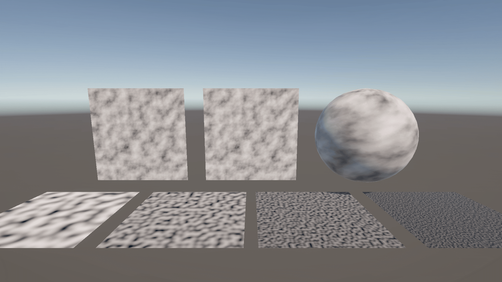
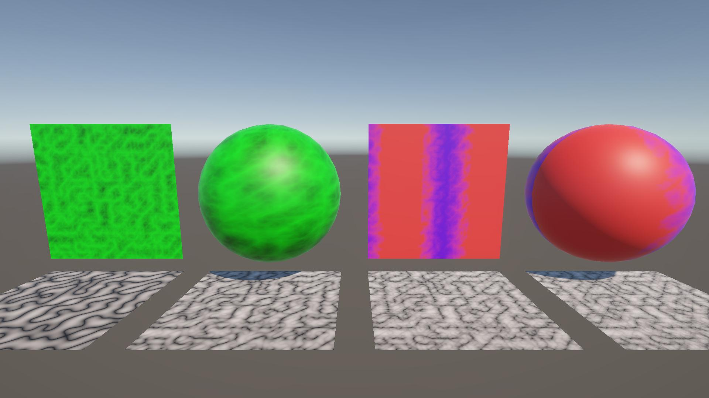
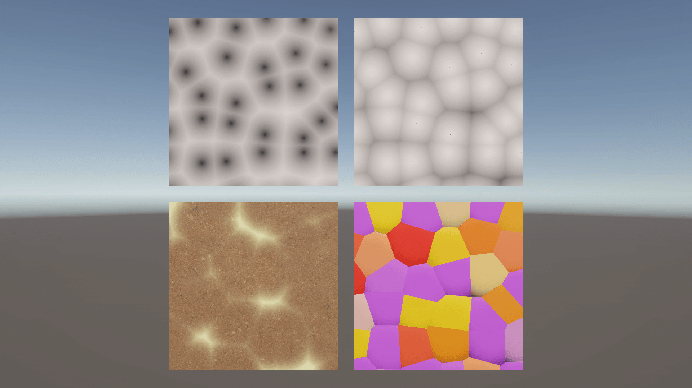

# ノイズ

## はじめに

プログラムワークショップⅣの管理用です

## 結果画像

### ノイズ

### FBM

### パターン

### ボロノイ図

### 炎

### ディゾルブ

### あなたの考えた素敵なシェーダー

-- 工夫した点：炎を配置し、その後ろにオブジェクトを置くことで暗くしまるで海底にいるような感じのシェーダーになりました。
またスタートした際壁にディゾルブ関連の物をつけ少しオシャレみたいにしてみました。あとは鳥居にそれぞれ光らしてみて奥にゴール地点のような物を配置してみました。
不思議な感じの雰囲気なシェーダーになったなと思っています。

## 進め方

- 本リポジトリ (tpu-game-2025/PGWS4_9_noise)をforkしてください
- fork先のリポジトリを更新してください
- Unityのプロジェクトをsrc内で進めてください
- 結果を画面キャプチャして、画像としてリポジトリに追加して、上記のリンクから見られるようにしてください
- 完成したら本リポジトリのmainブランチにpull requestを投げてください
